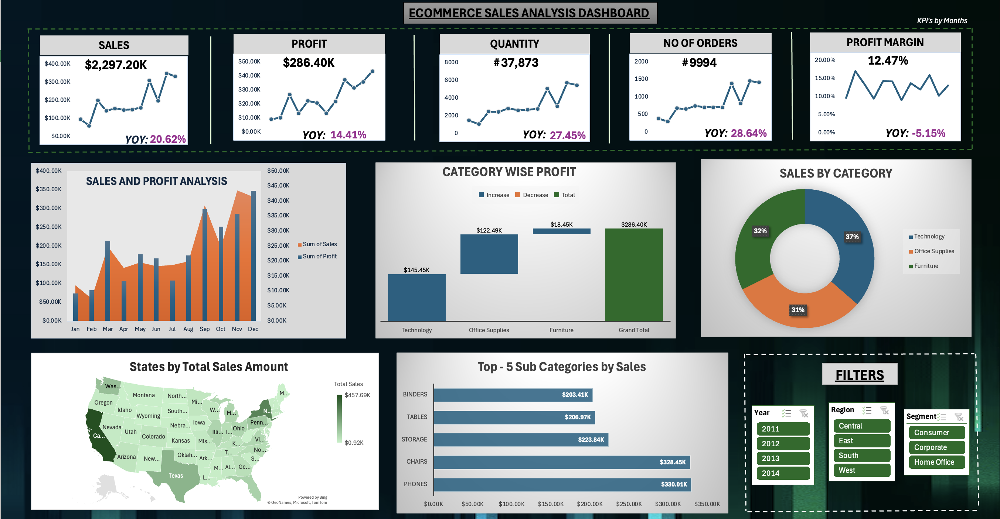

# E-Commerce Sales Analysis Dashboard (Microsoft Excel)

## Project Overview

This project is an interactive **E-Commerce Sales Analysis Dashboard** built entirely in **Microsoft Excel**. The dashboard enables users to analyze sales performance, profitability, orders, and product trends through dynamic visualizations and interactive slicers.

The dashboard provides business insights by allowing users to filter data by **Year**, **Region**, and **Segment**, with all KPIs and charts updating automatically.

---

## Dashboard Preview

```markdown

```

---

## Business Objectives

- Analyze overall sales performance.
- Monitor profit and profit margin trends.
- Identify top-performing product categories and sub-categories.
- Compare monthly sales and profit.
- Analyze geographical sales distribution.
- Enable interactive filtering for business decision-making.

---

## Dashboard Features

- Dynamic KPI Cards
  - Total Sales
  - Total Profit
  - Total Quantity
  - Total Orders
  - Profit Margin

-  Interactive Slicers
  - Year
  - Region
  - Segment

-  Monthly Sales vs Profit Analysis

-  Category-wise Profit Waterfall Chart

-  Category-wise Sales Contribution (Doughnut Chart)

-  State-wise Sales Distribution (Filled Map)

-  Top 5 Sub-Categories by Sales

-  Year-over-Year (YoY) KPI Growth Indicators

---

## Key Business Insights

-  **November** recorded the **highest Sales** across all months.
-  **December** generated the **highest Profit**.
-  **Technology** is the **most profitable category**, followed by **Office Supplies** and **Furniture**.
-  **Technology** contributes the **largest percentage of total Sales**, followed by **Office Supplies** and **Furniture**.
-  **California** recorded the **highest Sales**, while **North Dakota** recorded the **lowest Sales**.
-  **Phones** is the **highest-selling Sub-Category** based on total Sales.
-  The dashboard dynamically updates all KPIs and visualizations based on the selected **Year**, **Region**, and **Segment**.

---

## Tools & Technologies Used

- Microsoft Excel
- Pivot Tables
- Pivot Charts
- Pivot Maps
- Slicers
- GETPIVOTDATA
- Conditional Formatting
- Waterfall Charts
- Doughnut Charts
- Combo Charts
- Filled Map Charts

---

## KPIs Included

- Total Sales
- Total Profit
- Total Quantity Sold
- Total Orders
- Profit Margin
- Year-over-Year Growth

---

## Skills Demonstrated

- Data Cleaning
- Data Analysis
- Dashboard Design
- Business Intelligence
- KPI Reporting
- Data Visualization
- Excel Automation
- Pivot Table Analysis
- Interactive Reporting
- Business Insights Generation

---

## Dashboard Capabilities

✔ Dynamic filtering using slicers

✔ Interactive KPI cards

✔ Automatic chart updates

✔ Year-over-Year performance analysis

✔ Category and Sub-Category performance tracking

✔ Geographic sales analysis

✔ Executive-level dashboard reporting

---

## Business Value

This dashboard helps business stakeholders:

- Monitor sales performance in real time.
- Identify high-performing products and categories.
- Evaluate profitability trends.
- Analyze regional sales distribution.
- Make data-driven decisions using interactive reports.

---

## Author

**Sai Lohith Chimbili**

Master's Student | Data Analytics & Business Intelligence Enthusiast
